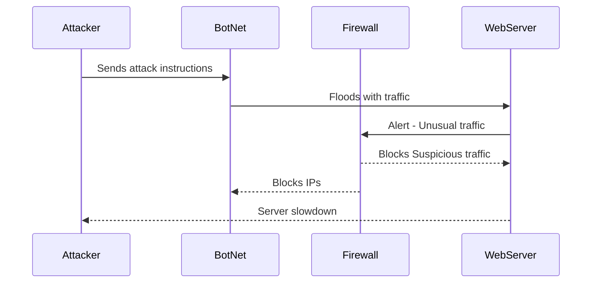

### DDoS Attack Sequence Explanation

1. **Attacker to BotNet**: The attacker initiates the attack by sending instructions to the compromised bots in the botnet.

2. **BotNet to WebServer**: The bots flood the target web server with excessive traffic, causing it to become overloaded.

3. **WebServer to Firewall**: The web server notices the usual spike in traffic and communicates with the firewall to investigate and mitigate the issue.

4. **Firewall's Response**:
  - The firewall analyzes traffic patterns to identify legitimate requests and to filter out malicious traffic.
  - The firewall blocks IPs associated with the BotNet, reducing the attack's impact.

5. **WebServer Impact**: Despite the firewall's efforts, the server may still experience slowdowns; however, implementing traffic filtering makes it possible to recover over time. 
